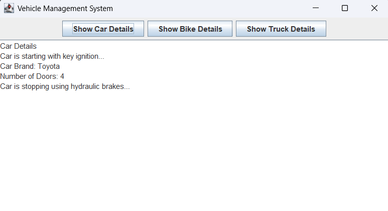

# 🚗 Vehicle-Management

This project simulates a basic vehicle management system using object-oriented programming concepts in Java. It allows representation and display of different types of vehicles such as Cars, Bikes, and Trucks. This project also includes a graphical user interface (GUI) using Java Swing for an interactive user experience.

---

## 📁 Project Structure

```
Vehicle-Management/
├── README.md
├── Bike.java
├── Car.java
├── Truck.java
├── Vehicle.java
├── VehicleManagementSystem.java
└── VehicleManagementSystemGUI.java
```

---

## 🧑‍💻 Team: Coding Knight Rider

- Harshit Sharma  
- Aditya Gupta  
- Aman Rai  
- Anurag Upadhyay  

---

## 📄 File Descriptions

- **Vehicle.java** – Abstract class that defines common properties and methods for all vehicles.  
- **Car.java** – Inherits from Vehicle; includes attributes specific to cars (e.g., seating capacity).  
- **Bike.java** – Inherits from Vehicle; includes attributes specific to bikes (e.g., gear status).  
- **Truck.java** – Inherits from Vehicle; includes attributes specific to trucks (e.g., load capacity).  
- **VehicleManagementSystem.java** – The main class that creates objects of different vehicle types and displays their information in a console-based application.  
- **VehicleManagementSystemGUI.java** – The main class that launches the graphical user interface for the vehicle management system.  

---

## 🔧 How to Run

### Console-Based Application

1. Make sure Java is installed on your system.  
2. Compile all `.java` files:
   ```bash
   javac *.java
   ```
3. Run the main class:
   ```bash
   java VehicleManagementSystem
   ```

### GUI-Based Application

1. Ensure you have Java installed (JDK 8 or higher).
2. Compile all Java files:
   ```powershell
   javac Vehicle.java Car.java Bike.java Truck.java VehicleManagementSystem.java VehicleManagementSystemGUI.java
   ```
3. Run the GUI application:
   ```powershell
   java VehicleManagementSystemGUI
   ```

---

## 💡 Concepts Used

- Inheritance  
- Polymorphism  
- Abstraction  
- Method Overriding  
- Java Class Hierarchies  

---

## 📌 GUI Example

Below is a screenshot of the Vehicle Management System GUI:



*Click on the buttons to view details for Car, Bike, or Truck in the text area.*

---

## 📬 Contact

For any queries or suggestions, feel free to reach out to any of the team members.

---

## Project Overview

This Java project demonstrates a simple Vehicle Management System with a graphical user interface (GUI) using Java Swing.

### Features
- View details for different vehicle types: Car, Bike, and Truck
- Simple and interactive GUI
- Uses OOP concepts (inheritance, polymorphism)

### Files
- `Vehicle.java` - Base class for all vehicles
- `Car.java` - Car class
- `Bike.java` - Bike class
- `Truck.java` - Truck class
- `VehicleManagementSystem.java` - Console-based main class
- `VehicleManagementSystemGUI.java` - GUI-based main class

### Usage
- Launch the GUI as described above.
- Click on the buttons to view details for Car, Bike, or Truck in the text area.

---

Feel free to modify or extend the project for your needs!
